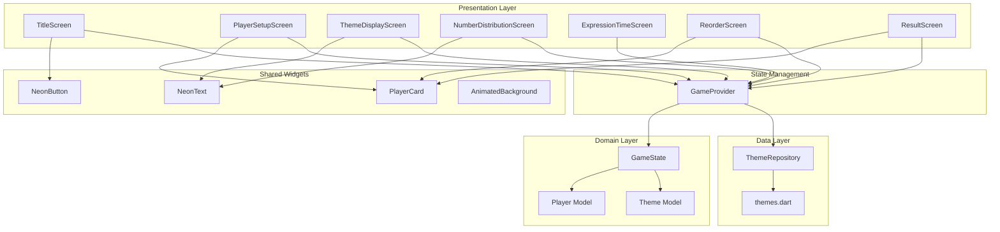
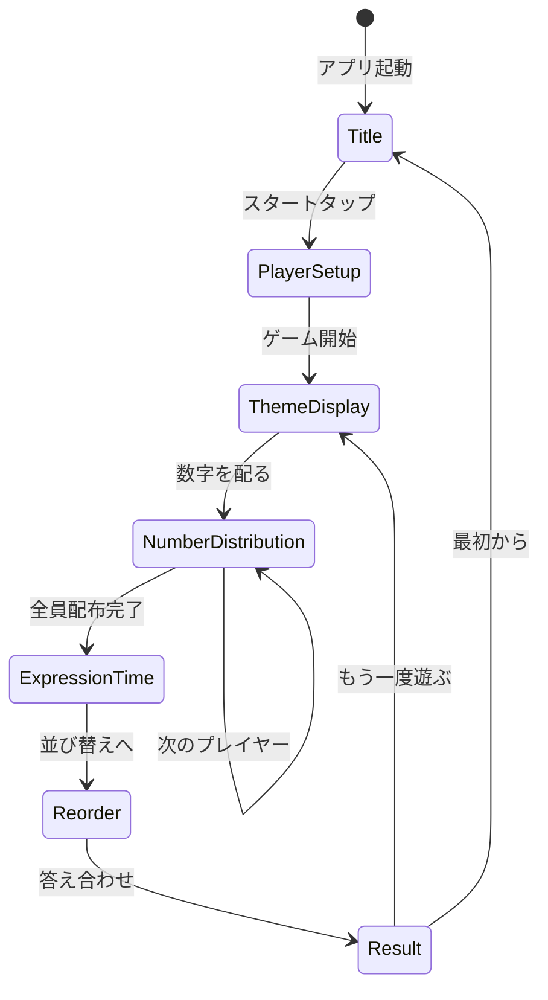
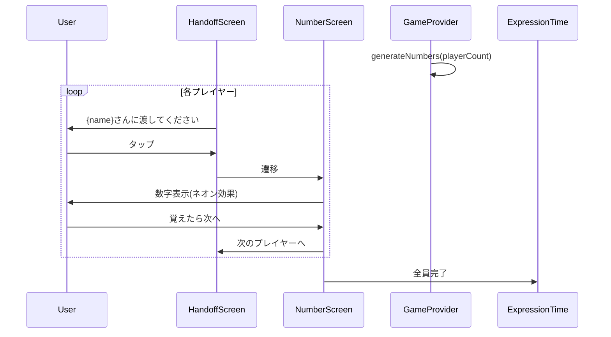
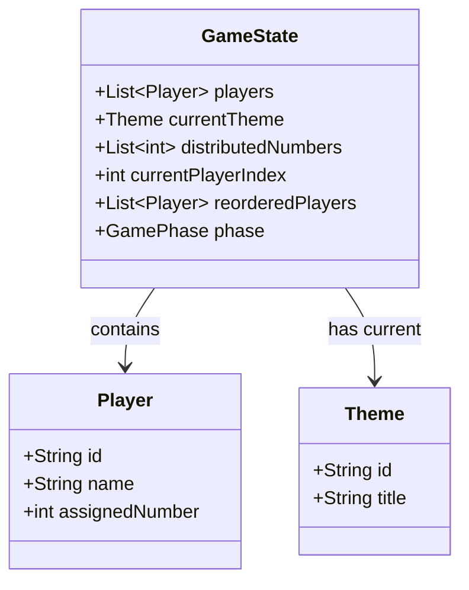

# Technical Design Document

## Overview

**Purpose**: 「ピンク Ito」アプリケーションの全7画面を実装し、2-10人のプレイヤーがオフラインでパーティゲームをプレイできるようにする。

**Users**: パーティや飲み会でのアイスブレイクとして大人向けゲームを楽しむユーザーグループ。1台のスマートフォンを回し見しながらプレイする。

**Impact**: 現在のFlutterテンプレート状態から、完全に機能するゲームアプリへ変更。タイトル画面からリザルト画面までの完全なゲームフローを提供。

### Goals
- 7画面（タイトル、プレイヤー設定、お題表示、数字配布、表現タイム、並び替え、リザルト）の完全実装
- ネオンピンクを基調としたスタイリッシュなUI/UXの実現
- 60fpsの滑らかなアニメーションと400ms以内の画面遷移
- オフライン完結型の動作保証

### Non-Goals
- バックエンド連携・ネットワーク機能
- ユーザー認証・アカウント機能
- 複数デバイス間の同期
- お題のアプリ内編集機能（開発者がソースコードで管理）
- プレイ統計・履歴の永続化（メモリ上のセッション管理のみ）

---

## Architecture

### Architecture Pattern & Boundary Map



**Architecture Integration**:
- **Selected Pattern**: Provider + ChangeNotifier（詳細は`research.md`参照）
- **Domain Boundaries**: Presentation（UI）、State Management、Domain（モデル）、Data（定数）の4層
- **Existing Patterns Preserved**: Flutter標準のMaterial Design、StatefulWidgetパターン
- **New Components Rationale**: GameProviderで画面間状態共有、共通ウィジェットでUI一貫性確保
- **Steering Compliance**: tech.mdのDart 3.10+/Flutter標準準拠、structure.mdのディレクトリ構成準拠

### Technology Stack

| Layer | Choice / Version | Role in Feature | Notes |
|-------|------------------|-----------------|-------|
| Framework | Flutter 3.10+ | クロスプラットフォームUI | iOS/Android/Web対応 |
| Language | Dart 3.10+ | アプリケーション実装 | null safety有効 |
| State | Provider 6.x | ゲーム状態管理 | ChangeNotifierパターン |
| Animation | flutter_animate 4.x | 宣言的アニメーション | ネオン効果、遷移 |
| Font | google_fonts | カスタムフォント | Noto Sans JP, Bebas Neue |
| UI | Material Design 3 | 標準ウィジェット | カスタムテーマ適用 |

---

## System Flows

### ゲーム全体フロー



### 数字配布サブフロー



**Key Decisions**:
- 数字配布は全プレイヤー分を事前生成し、インデックスで管理
- ハンドオフ→数字表示の遷移は同一Screenコンポーネント内で状態切り替え

---

## Requirements Traceability

| Requirement | Summary | Components | Interfaces | Flows |
|-------------|---------|------------|------------|-------|
| 1.1, 1.2, 1.3 | タイトル画面表示 | TitleScreen, NeonText | - | Title State |
| 1.4, 1.5 | タイトル画面操作 | TitleScreen, NeonButton | Navigator | Title→PlayerSetup |
| 2.1, 2.2 | プレイヤー数選択 | PlayerSetupScreen | GameProvider | - |
| 2.3, 2.4, 2.5, 2.6 | 名前入力・開始 | PlayerSetupScreen, PlayerCard | GameProvider | PlayerSetup→ThemeDisplay |
| 3.1, 3.2, 3.3, 3.4, 3.5 | お題表示 | ThemeDisplayScreen, NeonText | ThemeRepository | ThemeDisplay→NumberDistribution |
| 4.1-4.7 | 数字配布 | NumberDistributionScreen | GameProvider | NumberDistribution Loop |
| 5.1-5.4 | 表現タイム | ExpressionTimeScreen | GameProvider | ExpressionTime→Reorder |
| 6.1-6.6 | 並び替え | ReorderScreen, PlayerCard | GameProvider | Reorder→Result |
| 7.1-7.8 | リザルト表示 | ResultScreen, PlayerCard | GameProvider | Result→ThemeDisplay/Title |
| 8.1-8.5 | 共通デザイン | AppTheme, NeonText, NeonButton | - | 全画面 |
| 9.1-9.4 | お題データ管理 | ThemeRepository, themes.dart | - | ThemeDisplay |

---

## Components and Interfaces

### Summary

| Component | Domain/Layer | Intent | Req Coverage | Key Dependencies | Contracts |
|-----------|--------------|--------|--------------|------------------|-----------|
| GameProvider | State | ゲーム状態の一元管理 | 2-7, 9 | Provider (P0) | State |
| TitleScreen | Presentation | タイトル画面表示 | 1.1-1.5 | GameProvider (P1), Navigator (P0) | - |
| PlayerSetupScreen | Presentation | プレイヤー設定画面 | 2.1-2.6 | GameProvider (P0) | - |
| ThemeDisplayScreen | Presentation | お題表示画面 | 3.1-3.5 | GameProvider (P0), ThemeRepository (P0) | - |
| NumberDistributionScreen | Presentation | 数字配布画面 | 4.1-4.7 | GameProvider (P0) | - |
| ExpressionTimeScreen | Presentation | 表現タイム画面 | 5.1-5.4 | GameProvider (P0) | - |
| ReorderScreen | Presentation | 並び替え画面 | 6.1-6.6 | GameProvider (P0) | - |
| ResultScreen | Presentation | リザルト画面 | 7.1-7.8 | GameProvider (P0) | - |
| ThemeRepository | Data | お題データ管理 | 9.1-9.4 | themes.dart (P0) | Service |
| NeonText | Widgets | ネオン効果テキスト | 8.1, 8.5 | flutter_animate (P1) | - |
| NeonButton | Widgets | ネオン効果ボタン | 8.1, 8.3 | flutter_animate (P1) | - |
| PlayerCard | Widgets | プレイヤーカード | 2.3, 6.2, 7.2 | - | - |
| AppTheme | Constants | テーマ定義 | 8.1-8.5 | - | - |

---

### State Management

#### GameProvider

| Field | Detail |
|-------|--------|
| Intent | ゲーム全体の状態を管理し、画面間で共有する |
| Requirements | 2.1-2.6, 3.1-3.5, 4.1-4.7, 5.1-5.4, 6.1-6.6, 7.1-7.8, 9.3 |

**Responsibilities & Constraints**
- プレイヤーリスト、配布数字、現在のお題、並び順の一元管理
- 画面遷移をまたぐ状態の永続化（セッション内）
- 使用済みお題のトラッキング

**Dependencies**
- Inbound: 全Screen — 状態読み取り・更新 (P0)
- Outbound: ThemeRepository — お題取得 (P0)

**Contracts**: State [x]

##### State Management

```dart
class GameState {
  final List<Player> players;
  final Theme? currentTheme;
  final List<int> distributedNumbers;
  final int currentPlayerIndex;
  final List<Player> reorderedPlayers;
  final GamePhase phase;
}

enum GamePhase {
  title,
  playerSetup,
  themeDisplay,
  numberDistribution,
  expressionTime,
  reorder,
  result,
}

class GameProvider extends ChangeNotifier {
  GameState _state;
  final ThemeRepository _themeRepository;

  // プレイヤー管理
  void setPlayerCount(int count);
  void setPlayerName(int index, String name);

  // ゲームフロー
  void startGame();
  void selectTheme();
  void generateNumbers();
  void nextPlayer();
  void submitReorder(List<Player> order);

  // 結果判定
  bool checkResult();
  void playAgain();
  void resetGame();
}
```

- **State Model**: GameState immutableクラスで管理
- **Persistence**: メモリ上のみ（セッション内）
- **Concurrency**: 単一スレッド、同期的な状態更新

---

### Data Layer

#### ThemeRepository

| Field | Detail |
|-------|--------|
| Intent | お題データの取得と使用済み管理 |
| Requirements | 9.1-9.4 |

**Responsibilities & Constraints**
- 30個のお題プールからランダム選択
- 使用済みお題の除外
- 全使用時の自動リセット

**Dependencies**
- Inbound: GameProvider — お題取得 (P0)
- Outbound: themes.dart — 定数データ (P0)

**Contracts**: Service [x]

##### Service Interface

```dart
class ThemeRepository {
  List<Theme> getAvailableThemes();
  Theme getRandomTheme();
  void markAsUsed(String themeId);
  void resetUsedThemes();
  int get remainingCount;
}
```

- **Preconditions**: themes.dartに30個以上のお題が定義されていること
- **Postconditions**: 選択されたお題は使用済みリストに追加される
- **Invariants**: 利用可能なお題が0になった場合は自動リセット

---

### Presentation Layer

#### TitleScreen

| Field | Detail |
|-------|--------|
| Intent | アプリ起動時のタイトル画面を表示 |
| Requirements | 1.1, 1.2, 1.3, 1.4, 1.5 |

**Implementation Notes**
- NeonTextでロゴ表示、2秒周期のグロー明滅アニメーション
- NeonButtonでスタートボタン、パルスアニメーション
- Navigator.pushNamedでPlayerSetupScreenへ遷移

#### PlayerSetupScreen

| Field | Detail |
|-------|--------|
| Intent | プレイヤー人数と名前の設定 |
| Requirements | 2.1, 2.2, 2.3, 2.4, 2.5, 2.6 |

**Implementation Notes**
- Sliderで2-10人選択、選択数に応じてTextFieldを動的生成
- 全名前入力完了でボタン有効化（GameProvider.allPlayersReady）
- PlayerCardでプレイヤー一覧表示

#### ThemeDisplayScreen

| Field | Detail |
|-------|--------|
| Intent | ランダムお題の表示 |
| Requirements | 3.1, 3.2, 3.3, 3.4, 3.5 |

**Implementation Notes**
- flutter_animateでタイプライター効果（50ms/文字）
- ThemeRepository経由でお題取得
- ネオンフレーム装飾

#### NumberDistributionScreen

| Field | Detail |
|-------|--------|
| Intent | 各プレイヤーへの数字配布 |
| Requirements | 4.1, 4.2, 4.3, 4.4, 4.5, 4.6, 4.7 |

**Implementation Notes**
- ハンドオフ画面と数字表示画面を内部状態で切り替え
- 数字表示は120px以上、Bebas Neueフォント
- BoxShadow重ね合わせでネオングロー効果

#### ExpressionTimeScreen

| Field | Detail |
|-------|--------|
| Intent | 話し合い時間の提供 |
| Requirements | 5.1, 5.2, 5.3, 5.4 |

**Implementation Notes**
- リラックスした雰囲気、AnimatedBackgroundでパーティクル演出
- 上部にお題リマインダー（小さく表示）

#### ReorderScreen

| Field | Detail |
|-------|--------|
| Intent | プレイヤーの順序並び替え |
| Requirements | 6.1, 6.2, 6.3, 6.4, 6.5, 6.6 |

**Implementation Notes**
- ReorderableListViewでドラッグ&ドロップ実装
- proxyDecoratorでドラッグ中の浮遊効果（elevation増加、スケール1.05）
- ValueKey<String>(player.id)で各アイテム識別

#### ResultScreen

| Field | Detail |
|-------|--------|
| Intent | 答え合わせと結果表示 |
| Requirements | 7.1, 7.2, 7.3, 7.4, 7.5, 7.6, 7.7, 7.8 |

**Implementation Notes**
- 1.5秒間隔で順次公開（flutter_animate stagger）
- カードフリップアニメーションで数字公開
- 成功時: 紙吹雪（Confettiウィジェット）、金色グラデーション
- 失敗時: 正しい順番を表示

---

### Shared Widgets

#### NeonText

| Field | Detail |
|-------|--------|
| Intent | ネオングロー効果付きテキスト表示 |
| Requirements | 8.1, 8.5 |

**Props Interface**

```dart
class NeonText extends StatelessWidget {
  final String text;
  final double fontSize;
  final Color glowColor;      // default: #FF2D7B
  final bool animate;         // グロー明滅
  final Duration glowDuration; // default: 2秒
}
```

**Implementation Notes**
- 複数のBoxShadowでグロー効果を実現
- animateがtrueの場合、flutter_animateでopacity変化

#### NeonButton

| Field | Detail |
|-------|--------|
| Intent | ネオン効果付きボタン |
| Requirements | 8.1, 8.3 |

**Props Interface**

```dart
class NeonButton extends StatelessWidget {
  final String label;
  final VoidCallback onPressed;
  final bool enabled;
  final bool pulse;           // パルスアニメーション
  final ButtonStyle style;    // primary / secondary
}
```

**Implementation Notes**
- タップ時スケールアニメーション（1.0→0.95→1.0）
- pulseがtrueの場合、3秒周期でスケール変化
- InkWellでリップル効果

#### PlayerCard

| Field | Detail |
|-------|--------|
| Intent | プレイヤー情報表示カード |
| Requirements | 2.3, 6.2, 7.2 |

**Props Interface**

```dart
class PlayerCard extends StatelessWidget {
  final Player player;
  final int? rank;            // 順位表示（並び替え画面）
  final int? revealedNumber;  // 公開された数字（リザルト画面）
  final bool isCorrect;       // 正解/不正解表示
  final bool isDragging;      // ドラッグ中状態
}
```

---

## Data Models

### Domain Model



### Logical Data Model

**Player**
- `id`: String（UUID形式、一意識別子）
- `name`: String（1-20文字）
- `assignedNumber`: int（1-100、ゲーム開始時に割り当て）

**Theme**
- `id`: String（一意識別子）
- `title`: String（お題テキスト）

**GameState**
- `players`: List<Player>（2-10要素）
- `currentTheme`: Theme?（ゲーム中は非null）
- `distributedNumbers`: List<int>（players.lengthと同数）
- `currentPlayerIndex`: int（0 ≤ x < players.length）
- `reorderedPlayers`: List<Player>（並び替え後の順序）
- `phase`: GamePhase（現在の画面状態）

### Data Contracts

**themes.dart構造**

```dart
const List<Theme> themes = [
  Theme(id: '1', title: '気持ちいいもの'),
  Theme(id: '2', title: '恥ずかしいシチュエーション'),
  // ... 合計30個
];
```

---

## Error Handling

### Error Strategy

オフライン完結型アプリのため、ネットワークエラーは発生しない。主なエラーは入力バリデーションと状態不整合。

### Error Categories and Responses

**User Errors**:
- 空の名前入力 → フィールドレベルのバリデーションエラー表示
- プレイヤー数範囲外 → Sliderで制限（UI上で発生しない）

**System Errors**:
- お題データ不足 → アプリ起動時にアサーション、開発時に検出
- 状態不整合 → GamePhaseによる画面遷移制御で防止

**Business Logic Errors**:
- 並び替え未完了での答え合わせ → ボタン無効化で防止

---

## Testing Strategy

### Unit Tests
- GameProvider: 状態遷移、数字生成（重複なし確認）、結果判定
- ThemeRepository: ランダム選択、使用済み除外、リセット動作
- Player/Theme/GameState: モデルの不変性、コピー動作

### Widget Tests
- NeonText/NeonButton: アニメーション動作、タップコールバック
- PlayerCard: 各状態（通常、ドラッグ中、正解、不正解）の表示
- ReorderScreen: ドラッグ&ドロップ動作、順序更新

### Integration Tests
- 完全なゲームフロー: タイトル→プレイヤー設定→お題→数字配布→表現→並び替え→結果
- 繰り返しプレイ: お題の重複回避、リセット動作

---

## Performance & Scalability

### Target Metrics
- アニメーション: 60fps維持
- 画面遷移: 400ms以内
- アプリ起動: 3秒以内で操作可能

### Optimization Techniques
- RepaintBoundaryでアニメーション要素を分離
- const constructorの活用でリビルド削減
- 画像アセットの適切な圧縮（1x/2x/3x）

---

## Supporting References

### カラー定数

```dart
class AppColors {
  static const neonPink = Color(0xFFFF2D7B);
  static const neonPinkGlow = Color(0x80FF2D7B);
  static const deepMagenta = Color(0xFFC41E5C);
  static const darkBg = Color(0xFF0D0D0F);
  static const darkSurface = Color(0xFF1A1A1F);
  static const darkElevated = Color(0xFF252529);
  static const softGold = Color(0xFFD4AF37);
  static const electricPurple = Color(0xFF9D4EDD);
  static const warmWhite = Color(0xFFFFF5F5);
  static const mutedGray = Color(0xFF6B6B75);
}
```

### アニメーション定数

```dart
class AppAnimations {
  static const screenTransition = Duration(milliseconds: 350);
  static const buttonTap = Duration(milliseconds: 100);
  static const neonPulse = Duration(seconds: 2);
  static const typewriter = Duration(milliseconds: 50);
  static const cardReveal = Duration(milliseconds: 1500);
  static const defaultCurve = Curves.easeInOut;
}
```
